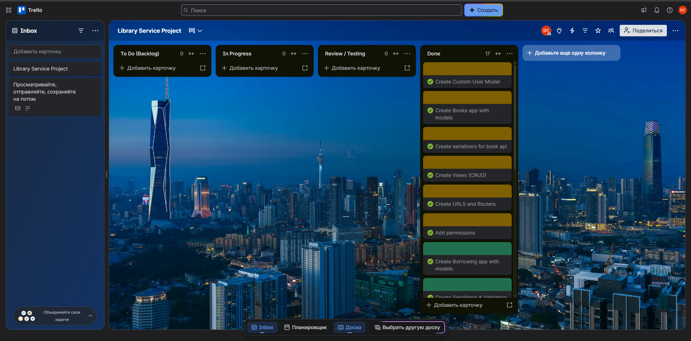

# Library Service API 📚

An online management system for book borrowings, built with Django and Django REST Framework. This project optimizes library administration by replacing outdated manual tracking with a robust, web-based API.

## Features
* **User Management:** Custom user model (Email-based authentication) with JWT tokens.
* **Books Inventory:** CRUD operations for library books.
* **Borrowing System:** Borrow books with automatic inventory management (`inventory - 1`).
* **Return Mechanism:** Custom endpoint to return books and restore inventory (`inventory + 1`).
* **Role-Based Access:** 
  * Regular users can view books and manage their own borrowings.
  * Library staff (Admins) can manage inventory and view all system borrowings.

## Tech Stack
* Python 3
* Django
* Django REST Framework (DRF)
* SimpleJWT (Authentication)
* drf-spectacular (Swagger Documentation)

## Local Setup & Installation

1. **Clone the repository:**
   ```bash
    git clone [https://github.com/your-username/library-service.git](https://github.com/your-username/library-service.git)
    cd library-service
    ```

2. **Create and activate a virtual environment (optional but recommended)**
    python -m venv venv
    source venv/bin/activate  # On Windows use `venv\Scripts\activate`

3. **Install dependencies:**
    ```bash
    pip install -r requirements.txt
    ```

4. **Apply database migrations:**
    ```bash
    python manage.py migrate
    ```

5. **Create a superuser (Admin):**
    ```bash
    python manage.py createsuperuser
    ```

6. **Run the development server:**
    ```bash
    python manage.py runserver
    ```

## Project Management (Trello)
The development process, task tracking, and Agile workflow for this project were managed using Trello.

* **View the Trello Board:** [Click here to view](https://trello.com/invite/b/6a95a584e3ed3cea01dc7763/ATTI3887a5bffb0542af50bea2246f2689f13906E951/library-service-project)

